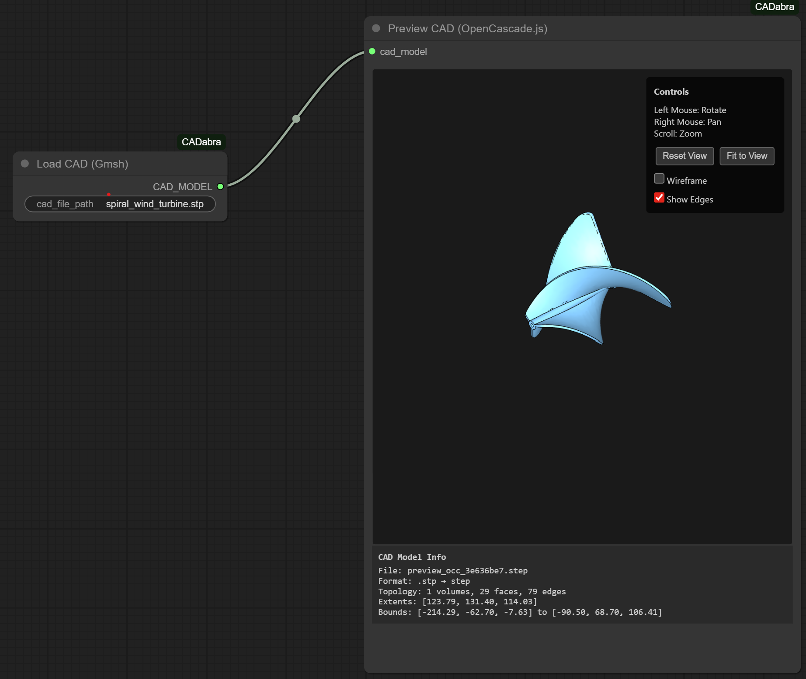
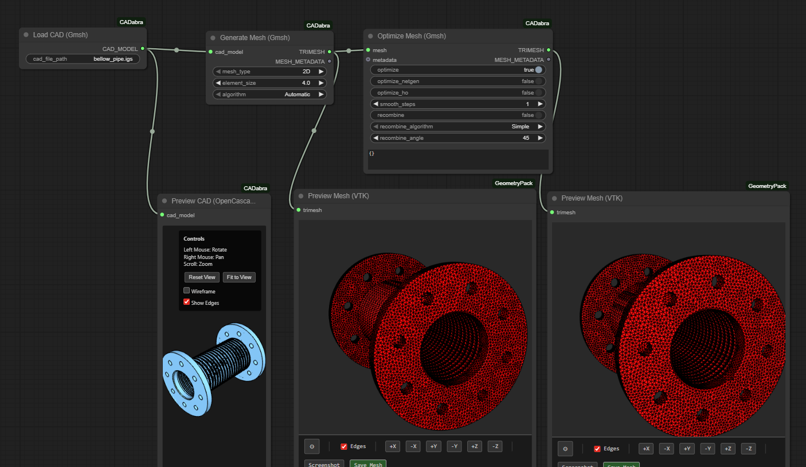

# ComfyUI-CADabra

CAD file processing and ML-based surface reconstruction nodes for ComfyUI.




## Nodes

**CAD_Load_Gmsh** - Load STEP, IGES, and BREP CAD files using Gmsh

**CAD_Mesh_Gmsh** - Generate 2D/3D meshes from CAD models with configurable element size and algorithms

**CAD_Mesh_Gmsh_Advanced** - Advanced mesh generation with:
- Size field controls (min/max element size)
- Curvature-based adaptive sizing
- Extended algorithms (MeshAdapt, BAMG, DelQuad, MMG3D, HXT)
- Higher-order elements (1st through 5th order)
- Subdivision and refinement options
- JSON input for custom gmsh options

**Mesh_Optimize_Gmsh** - Post-process meshes with:
- Mesh optimization (Netgen, high-order)
- Smoothing iterations
- Triangle-to-quad recombination
- Multiple recombination algorithms (Simple, Blossom, etc.)
- JSON input for custom gmsh options

**ML_SurfaceRecon** - Surface reconstruction using ML models (stub for hustvl/surface-recon, point2surf, patchnetsurface, point2shape)

**ML_FeatureDetection** - CAD feature detection using ML models (stub for autodesk/feature-detection-cad, hustvl/cad-features)

**CAD_Viewer** - Interactive Three.js-based 3D viewer for CAD models and meshes

## Features

- **Interactive CAD Viewer**: OpenCascade.js-based 3D viewer with orbit controls
- **Smart File Loading**: Automatically searches in `input/`, `input/cad/`, and custom paths
- **Bundled Libraries**: Three.js and OpenCascade.js served locally (no CDN dependencies)
- **Multiple Formats**: STEP (.step, .stp), IGES (.iges, .igs), BREP (.brep)
- **Mesh Generation**: Configurable 2D/3D meshing with Gmsh

## Installation

```bash
cd ComfyUI/custom_nodes
git clone https://github.com/PozzettiAndrea/ComfyUI-CADabra
cd ComfyUI-CADabra
pip install gmsh
```

System dependencies (auto-installed on Linux):
- `libglu1-mesa` - OpenGL utility library
- `libxft2` - X11 FreeType interface library

## Usage

Place your CAD files in:
- `ComfyUI/input/cad/` (recommended)
- `ComfyUI/input/` (also works)
- Any absolute path

Then reference them in the **CAD Load (Gmsh)** node with just the filename.

### Advanced Meshing

For advanced mesh control, use **CAD_Mesh_Gmsh_Advanced** with custom gmsh options via JSON:

```json
{
  "Mesh.Optimize": 1,
  "Mesh.OptimizeNetgen": 1,
  "Mesh.RecombineAll": 1,
  "Mesh.Algorithm": 8
}
```

Common workflows:
- **Simple**: `CAD_Load_Gmsh` → `CAD_Mesh_Gmsh` → output
- **Advanced**: `CAD_Load_Gmsh` → `CAD_Mesh_Gmsh_Advanced` → `Mesh_Optimize_Gmsh` → output
- **High-quality**: Use curvature-based sizing + 2nd order elements + optimization

## Notes

- ML nodes are currently stubs - integrate HuggingFace models as needed
- For publishing to Comfy Registry, see [PUBLISHING.md](PUBLISHING.md)
